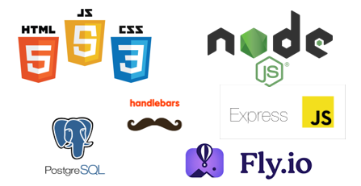
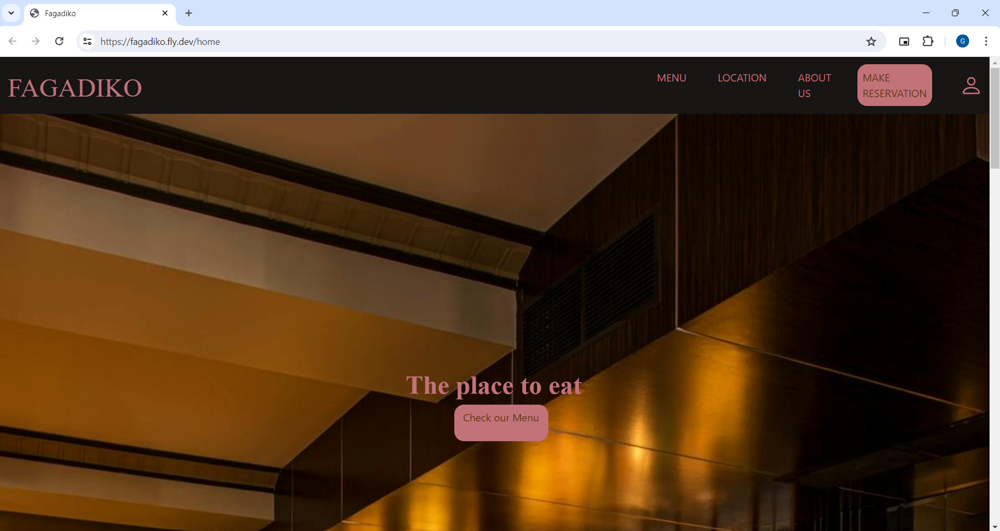
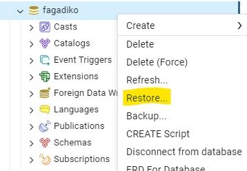
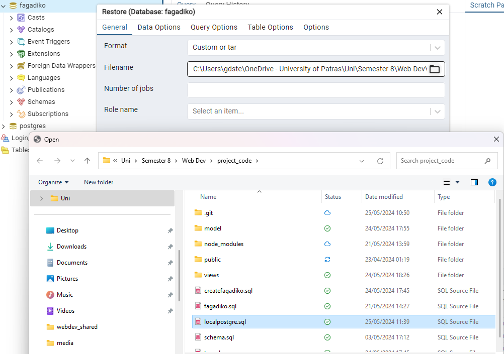
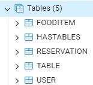
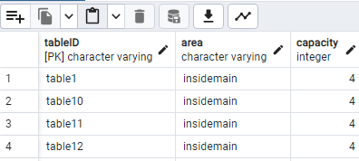

<h1>Εφαρμογή Υποστήριξης Εφαρμογών</h1>
Υλοποιήθηκε στα πλάισια του μαθήματος: <b>Προγραμματισμός Διαδυκτίου.</b>  

<b>Στεργιόπουλος Γεώργιος</b> 
<b>Πανουργιάς Αντώνιος</b> 

Υλοποιήθηκε με node.js/express/html/css και χρήση Handlebars.

<h2>Η εφαρμογή μας online.</h2>
<h3>Η εφαρμογή μας έγινε host στο fly.io, μέσω του δωρεάν trial που παρέχεται (δείτε "ΠΡΟΣΟΧΗ" πιο κάτω)</h3>
<h4><a href="https://fagadiko.fly.dev">Δοκιμάστε την</a></h4>

Μπορείτε να περιηγείθειτε στην εφαρμογή με όποιον τρόπο θέλετε. 
Σε περίπτωση που δεν θέλετε να δημιουργήσετε λογαριασμό μπορείτε να αξιοποιήσετε τον demo user: 

<b>User</b> 
<b>username: </b>anton 
<b>password: </b>123456  

ή για να δείτε τις δυνατότητες του διαχειριστή:  
<b>Admin User</b> 
<b>username: </b>gster 
<b>password: </b>123456 

<h3><b>ΠΡΟΣΟΧΗ:</b></h3>
Λόγο του δωρεάν πλάνου της fly.io, η ΒΔ, μετά από κάποιο χρονικό διάστημα κλείνει με αποτέλεσμα να μην είναι δυνατή η online, χρήση της εφαρμογής χωρίς
να κάνουμε εμείς, ως διαχειριστές, του server στο fly.io start machine  manualy .

Αν θέλετε να δείτε την online version και δεν λειτουργεί η ΒΔ επικοινωνήστε: 
    gstergiopoulos@ac.upatras.gr 
    up1083996@ac.upatras.gr 

Για αυτό τον λόγο παρέχουμε την παρακάτω εναλλακτική:  

<h2>Οδηγίες για εκτέλεση της εφαρμογής <b>ΤΟΠΙΚΑ</b> σε υπολογιστή με εγκατεστημένη NodeJS:</h2>
Αρχικά, κατεβάστε τον κώδικα απο αυτό το repository στον υπολογιστή σας και αποθηκεύσετε τον τοπικά.
<h3>Για να τρέξει η εφαρμογή πρέπει να εκτελέστουν οι παρακάτω εντολές βρισκόμενοι στο path που έχετε τοποθετήσει τον πηγαιό κώδικα:</h3>
<ul>
    <li>npm install</li>
    <li>npm audit fix --force</li>
    <li>npm run watch ή nodemon ή node app.mjs</li>
</ul>
Για να είναι όμως πλήρως λειτουργική χρειάζεται να στηθεί μια τοπική ΒΔ:
<ul>
    <li>Κατεβάστε το pgAdmin 4, συμπεριλαμβάνοντας την εγκατάστη της PostgreSQL</li>
    <li>Στο pgAdmin δημιουργείστε μια ΒΔ, και ονομάστε την fagadiko με κωδικό 123456.</li>
    <li>Κάντε δεξί κλίκ στην βάση αυτή και επιλέξτε Restore..</li>
    
    <li>Στο restore window, επιλέξτε να γίνει μέσω του αρχείου localpostgre.sql</li>
    
    <li>Ελέγξτε μέσω του pgAdmin, οτι η ΒΔ, στο schema της έχει το παρακάτω schema αλλά και εγγραφές.</li>
    
    <li>Δείτε για έναν πίνακα πχ τον TABLE, ότι έχουν εισαχθεί και τα δεδομένα</li>
    
</ul>
Αφότου έχει η ΒΔ δημιουργηθεί οπώς είπαμε παραπάνω, ξανα τρέξτε την εφαρμογή και περιηγηθείτε με τον τρόπο που επιθυμείτε (δημιουργεία λογαριασμο κλπ).
Για την καλύτερη σας περιήγηση συνιστούμε την χρήση του demo user:  
<b>User:</b> 
                                                    <b>username: </b>test 
                                                    <b>password: </b>test  
Για την περιήγηση ως διαχειριστής συνιστούμε την χρήση του Admin user  
<b>Admin User:</b> 
                                                    <b>username: </b>gster 
                                                    <b>password: </b>123456 
                                        
 

